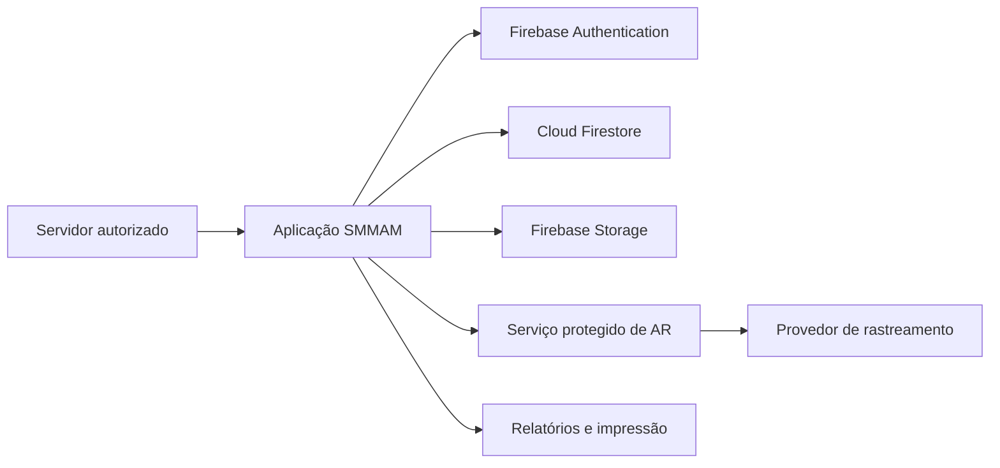

# SMMAM Notificações

Sistema interno da Secretaria Municipal do Meio Ambiente de Bento Gonçalves para registrar, acompanhar e administrar **notificações**, **autos de infração**, **retornos de AR**, **evidências**, **consulta cadastral imobiliária** e **relatórios operacionais**.

> **Classificação recomendada:** uso interno restrito. O sistema trata dados pessoais, dados imobiliários, registros de fiscalização e evidências. Não deve ser publicado como site de acesso público.

## Visão do produto

O sistema apoia o trabalho de fiscalização desde a identificação do imóvel até a emissão, o acompanhamento e o arquivamento de documentos. Ele separa dados por setor, utiliza perfis de acesso e mantém um histórico de auditoria para ações relevantes.

| Módulo | Finalidade |
|---|---|
| Notificações | Cadastrar, editar, imprimir, arquivar e acompanhar prazo, recebimento e AR. |
| Autos de infração | Criar autos, associar infrações e calcular multa a partir da URM configurada. |
| Consulta cadastral | Localizar imóvel por inscrição, CPF/CNPJ, nome ou endereço e reaproveitar os dados no documento. |
| Evidências | Registrar fotos associadas a notificações e autos. |
| Correios / AR | Consultar o rastreamento do AR em lote limitado, com serviço protegido e link oficial de contingência. |
| Relatórios | Mostrar volume, evolução, bairro, fiscal, situação e valor estimado de multas. |
| Administração | Gerenciar usuários, níveis, exceções de domínio, infrações, URM, importação de IPTU e auditoria. |

### Modelo de notificação e prévia

O formulário de notificação incorpora o modelo documental institucional, com RG/CNH, identificação completa do destinatário, endereço de correspondência, cadastro imobiliário, motivo, infrações, orientações, prazo, bases legais e assinaturas. **A gravação de notificação passa obrigatoriamente pela prévia**, que permite voltar para edição, imprimir/salvar em PDF ou confirmar a gravação. A numeração definitiva continua sendo atribuída exclusivamente no backend durante o salvamento.

Os prazos de regularização e defesa, a URM, os textos padrão de motivo, as orientações e o endereço de apresentação podem ser definidos por administrador na área de configurações. Esses parâmetros ficam registrados como cópia no documento emitido, preservando o contexto histórico da emissão. Consulte `ADAPTACAO_NOVO_MODELO_NOTIFICACAO.md` para a especificação de adaptação.

O novo modelo preserva integralmente os dados usados pelo CSV VIPP: nome, endereço, número, complemento, bairro, município, UF, CEP, telefone, CPF/CNPJ, modalidade de AR e número da notificação.

### Acompanhamento após a emissão

Depois de emitida, uma notificação não pode mais ter seu conteúdo documental alterado nem ser excluída. O painel passa a oferecer **Acompanhar**, que registra eventos auditáveis de postagem, trânsito, entrega ou devolução do AR, confirmação de ciência, pedido/decisão de prorrogação, vistoria de retorno e confirmação de limpeza. A entrega do AR não presume a ciência jurídica: a data de ciência deve ser confirmada em evento próprio. O acompanhamento altera apenas situação operacional, prazo derivado quando houver prorrogação deferida e dados de controle; o documento impresso original é preservado.

O ciclo completo está especificado em `ACOMPANHAMENTO_NOTIFICACOES.md`.

## Arquitetura atual

| Camada | Tecnologia atual | Responsabilidade |
|---|---|---|
| Interface | HTML, CSS e JavaScript ES modules | Telas e fluxos operacionais. |
| Identidade | Firebase Authentication | Login, cadastro e recuperação de senha. |
| Banco | Cloud Firestore | Dados de documentos, usuários, regras de negócio e auditoria. |
| Arquivos | Firestore e Firebase Storage | Evidências atuais e cópia auxiliar da base IPTU. |
| Hospedagem | Firebase Hosting | Entrega da aplicação web. |
| Rastreamento AR | Cloudflare Worker + Durable Object + segredo do provedor | Consulta compartilhada e com limite de chamadas. |

### Fluxo de dados resumido



## Perfis e permissões

| Perfil | Uso previsto |
|---|---|
| Leitor | Consulta registros permitidos, sem criar ou editar documentos. |
| Operador | Registra e edita documentos de seu setor, conforme as regras vigentes. |
| Administrador | Gerencia usuários, parâmetros setoriais, infrações, backup e funções administrativas. |

Os perfis dependem de um documento em `usuarios/{uid}` com, no mínimo, `setor`, `status` e `nivel`. Para o acesso operacional, o perfil precisa estar com `status: "aprovado"`.

## Manual de desenvolvimento em múltiplos computadores

O procedimento oficial para trabalhar no projeto usando Google Antigravity, Codespaces ou outro computador está em [`GUIA_ANTIGRAVITY_GIT_MULTICOMPUTADOR.md`](GUIA_ANTIGRAVITY_GIT_MULTICOMPUTADOR.md). O manual define o GitHub como fonte única de verdade, exige branches e commits, descreve a sincronização entre máquinas e protege explicitamente a exportação VIPP.

## Estrutura do repositório

```text
.
├── index.html                         # Interface da aplicação
├── css/style.css                      # Estilo e responsividade
├── js/app.js                          # Fluxos atuais da SPA
├── js/correios-provider.js            # Normalização do provedor de rastreamento
├── firestore.rules                    # Autorização do Firestore
├── storage.rules                      # Autorização do Storage
├── firestore.indexes.json             # Índices do Firestore
├── workers/ar-sync-worker.mjs         # Serviço protegido de consulta AR
├── scripts/smoke-test.mjs             # Verificação mínima de integridade
├── scripts/prepare-ar-worker-*.mjs    # Apoio à preparação do Worker
├── POLITICA-PRIVACIDADE.html           # Aviso público de privacidade
└── docs e manuais                     # Continuidade, implantação e análise
```

## Modelo de dados atual

| Coleção/caminho | Conteúdo principal | Observação |
|---|---|---|
| `usuarios` | Perfil institucional, setor, nível, status e dados funcionais. | Base da autorização por setor. |
| `notificacoes` | Notificações e autos, dados do notificado, imóvel, prazo, AR, infrações e auditoria básica. | O campo `tipoDocumento` diferencia notificação e auto. |
| `notificacoes/{id}/evidencias` | Fotos vinculadas aos documentos. | Migração para Storage é prioridade P0. |
| `infracoes_config` | Infrações, base legal, texto padrão e URM por setor. | Administração setorial. |
| `cadastro_imobiliario` | Dados importados do cadastro/IPTU. | Dados pessoais e patrimoniais sensíveis. |
| `configuracoes` | URM, lista de exceções e parâmetros. | Deve ter separação entre configurações administrativas e operacionais. |
| `logs_auditoria` | Eventos de operação. | A próxima evolução deve registrar eventos no backend. |

## Prazos legais de fiscalização

O sistema calcula os prazos abaixo a partir da data de ciência efetivamente informada pelo servidor. A notificação não é tratada como defesa: seu prazo é de **regularização**. A data de entrega de AR sem data certificada permanece pendente de confirmação para evitar a presunção de um fato jurídico.

| Documento | Prazo no sistema | Marco de contagem | Referência |
|---|---:|---|---|
| Notificação | 60 dias corridos para regularização | Recebimento da notificação | Art. 25 da LC Municipal nº 6/1996, em redação alterada pela LC nº 245/2023. [3] |
| Auto de Infração | 8 dias corridos para defesa escrita | Ciência do Auto | Art. 28 da LC Municipal nº 6/1996. [3] |

> A implementação conta dias corridos a partir do dia seguinte à data de recebimento ou ciência. A aplicabilidade para ciência postal, recusa, edital, feriados e procedimentos setoriais deve ser homologada pelo jurídico e pela gestão municipal antes do uso em produção. Consulte `BASE_LEGAL_PRAZOS_DEFESA.md` para a fonte e a interpretação registrada.

## Operação local e validação

### Pré-requisitos

Use Node.js LTS, Firebase CLI e credenciais administrativas somente em estação institucional autorizada. Para o Worker, use uma conta de infraestrutura com acesso ao ambiente correspondente. Não inclua senhas, tokens de produção ou arquivos de credencial no Git.

### Verificações disponíveis

```bash
node scripts/smoke-test.mjs
node --check js/app.js
node --check workers/ar-sync-worker.mjs
git diff --check
```

Para testar regras e dados sem atingir produção, configure emuladores Firebase e uma base de teste. As regras de Firestore são avaliadas em toda solicitação feita pelo SDK cliente, e devem ser testadas para cada perfil de usuário. [1]

## Configurações críticas

| Item | Local atual | Regra de continuidade |
|---|---|---|
| Projeto Firebase | `.firebaserc` e configuração pública do frontend | Nunca usar o projeto de produção para testes de migração. |
| Regras Firestore | `firestore.rules` | Versão controlada, teste em emulador e publicação somente por pipeline. |
| Regras Storage | `storage.rules` | Restringir caminho, tipo e tamanho de arquivo. [2] |
| Segredo do AR | Variável `RAPIDAPI_AR_KEY` do Worker | Manter somente no cofre/secret manager do ambiente. |
| Origem permitida do Worker | `ALLOWED_ORIGIN` no Worker | Deve coincidir com os domínios oficiais de produção e homologação. |
| Cota do provedor | Configuração operacional de AR | Monitorar consumo e manter contingência pelo rastreamento oficial/CSV. |

## Continuidade por outra equipe

Antes de alterar o sistema, a pessoa responsável deve: ler `ANALISE_REPOSITORIO.md`, `PLANO_AUTONOMO_P0_P1_P2.md`, `MANUAL_MIGRACAO_HOSPEDAGEM_MUNICIPIO.md`, `firestore.rules`, `storage.rules`, os documentos de operação de AR e o histórico de commits. A primeira atividade deve ser executar os testes existentes em ambiente de homologação e criar uma linha de base de segurança.

Nenhuma alteração de regra, migração de foto, importação de IPTU, mudança de DNS, mudança de segredo ou publicação em produção deve ocorrer sem backup validado, plano de reversão e aprovação registrada do responsável institucional.

## Próximas prioridades

1. **P0:** eliminar XSS, criar numeração atômica, migrar evidências ao Storage e restringir leituras sensíveis.
2. **P1:** modularizar o código, tornar auditoria confiável, paginar consultas e mover importação de IPTU para job administrativo.
3. **P2:** implantar tramitação, SLA, associação territorial e relatórios gerenciais exportáveis.

Consulte o plano completo para critérios de aceite, automações e bloqueios de produção.

## Referências

[1] [Firebase — Firestore Security Rules](https://firebase.google.com/docs/firestore/security/get-started)

[2] [Firebase — Cloud Storage Security Rules](https://firebase.google.com/docs/storage/security)

[3] [Câmara Municipal de Bento Gonçalves — Lei Complementar nº 6/1996, texto atual](https://sapl.camarabento.rs.gov.br/norma/4045)
